# Smart Poultry Farm IoT

An IoT-based Smart Poultry Farm Monitoring and Automation System built using ESP32-S3, MQTT communication, Android application, and intelligent power management.

---

## Project Overview

The Smart Poultry Farm IoT system provides real-time monitoring and automated control of poultry farm environmental conditions.

The system continuously monitors:

* Temperature
* Humidity
* Air Quality
* Water Level
* Feed Level
* Light Intensity
* Battery Voltage
* System Current

Based on configurable thresholds, the system automatically controls:

* Ventilation Fan
* Heater
* Water Pump
* Lighting System
* Automatic Feeder
* Solar / AC Power Switching

---

## Features

### Real-Time Monitoring

* Temperature Monitoring
* Humidity Monitoring
* Air Quality Monitoring
* Water Level Monitoring
* Feed Level Monitoring
* Light Level Monitoring
* Battery Voltage Monitoring
* System Current Monitoring

### Automated Control

* Fan Control
* Heater Control
* Water Pump Control
* Lighting Control
* Ventilation Control
* Automatic Feeding System

### Android Application

* Secure Login
* Live Dashboard
* Actuator Controls
* Historical Analytics
* Configuration Settings
* Feeding Schedule Management
* Power Management Settings

### Power Management

* Solar / AC Hybrid Operation
* Automatic Source Switching
* Battery Monitoring
* Voltage-Based Power Selection

### Communication

* MQTT Protocol
* Real-Time Data Synchronization
* Remote Monitoring and Control

---

# System Architecture

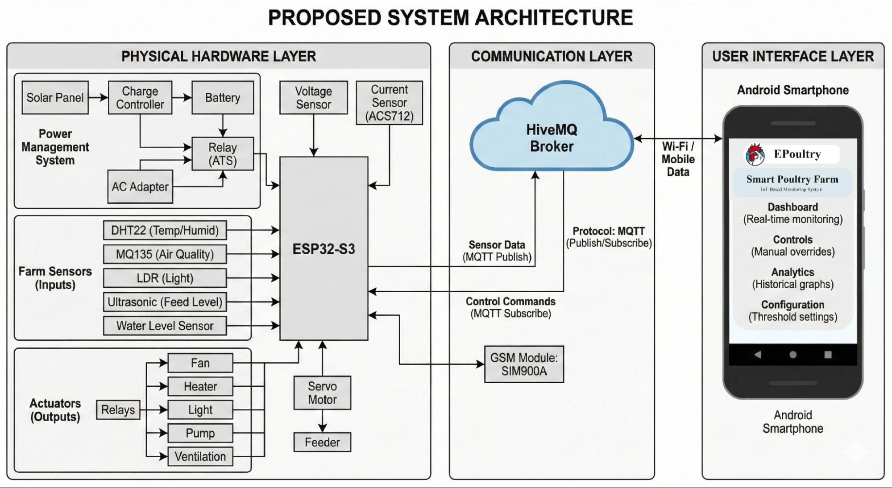

---

# Firmware Design

### Main Firmware Flowchart

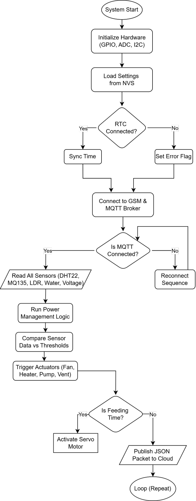

### App-Firmware Communication Flow

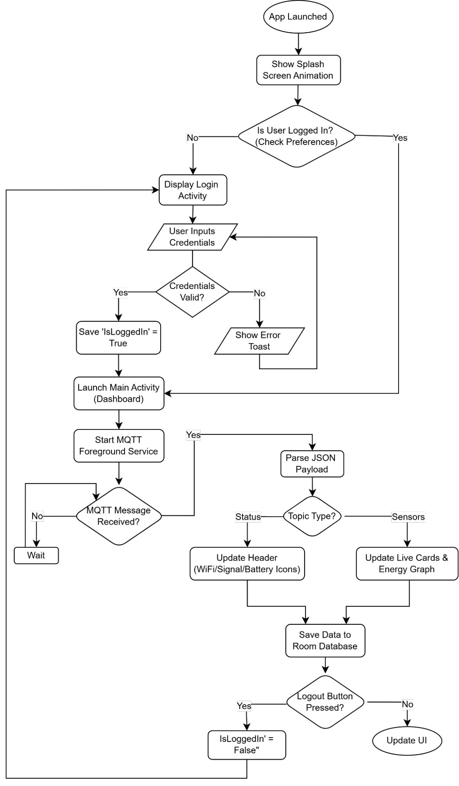

### Power Management Flow

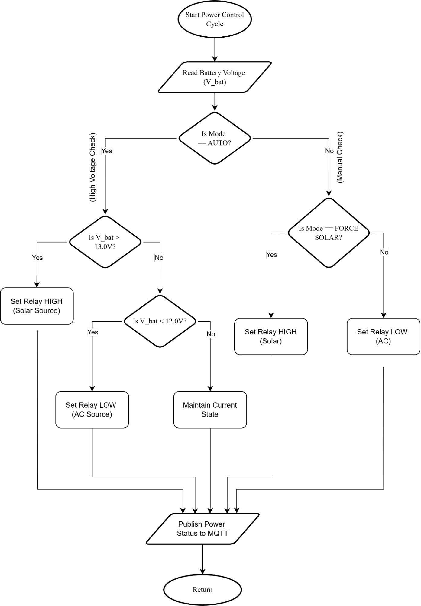

---

# Circuit Design


---

# Android Application

## Login Screen

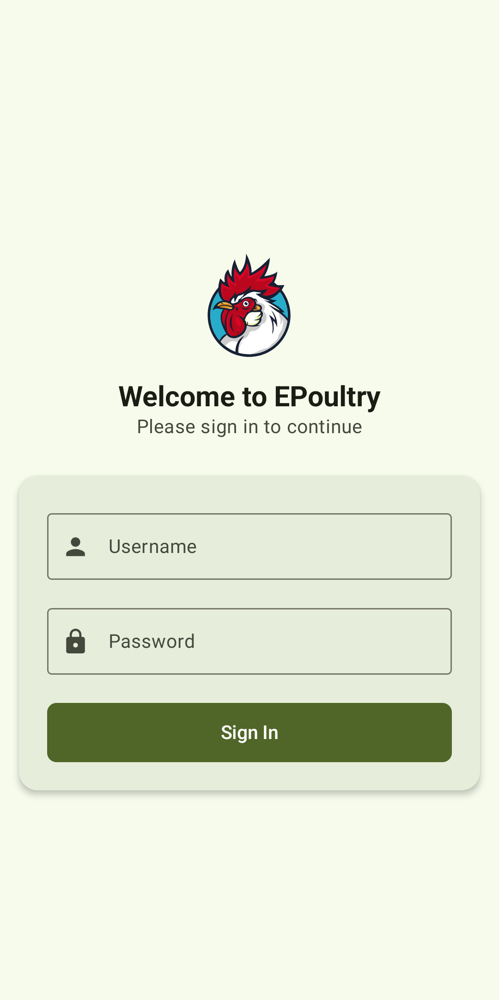

## Dashboard

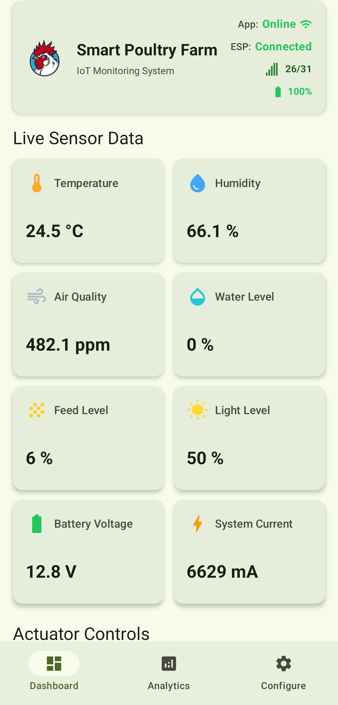

## Actuator Controls

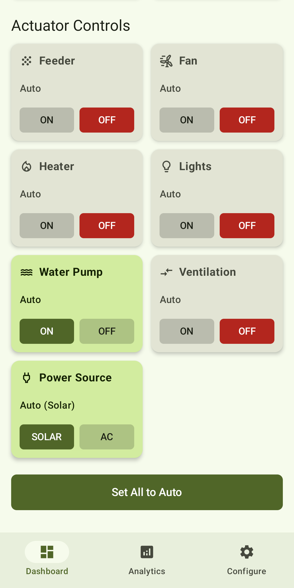

## Analytics Overview


## Analytics Charts


## Sensor Configuration

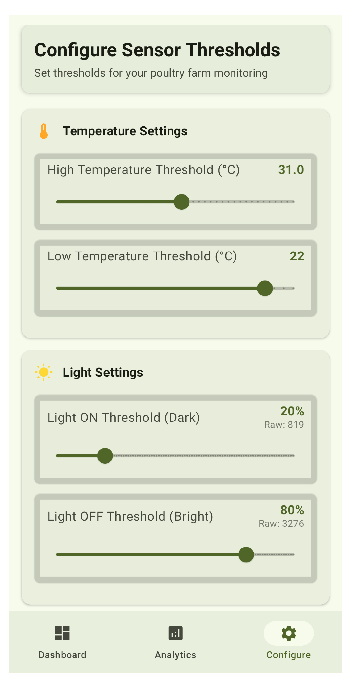

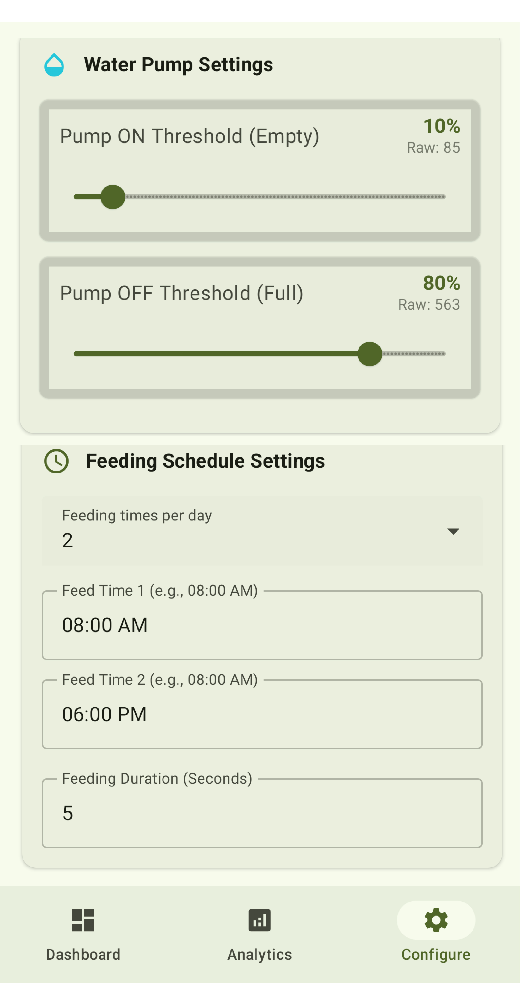

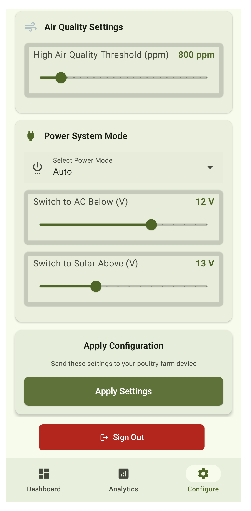

## Feeding Schedule

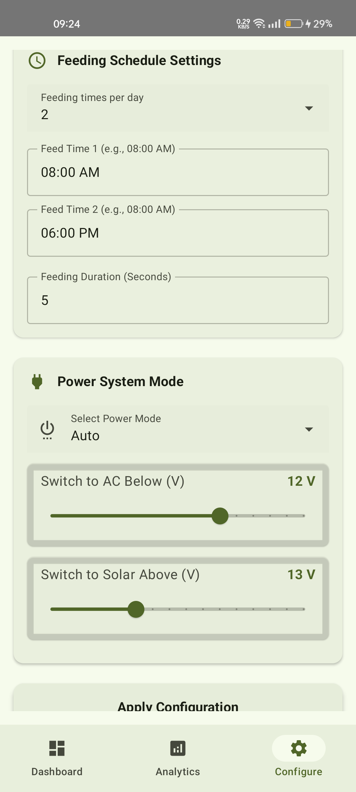

## Power Settings

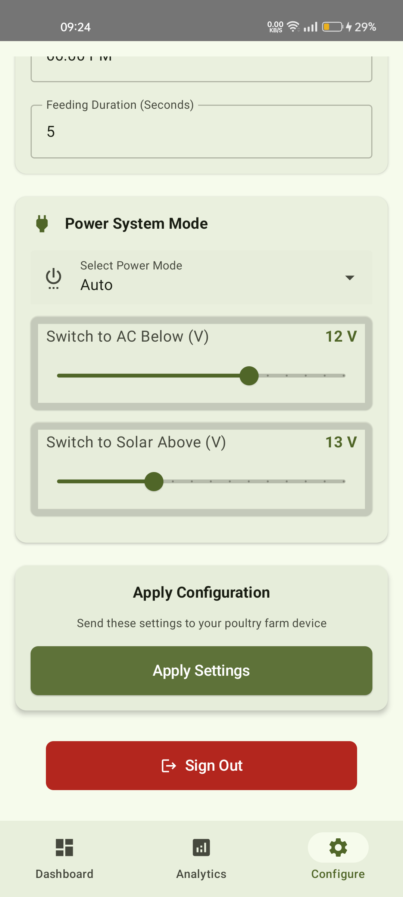

## Web Dashboard

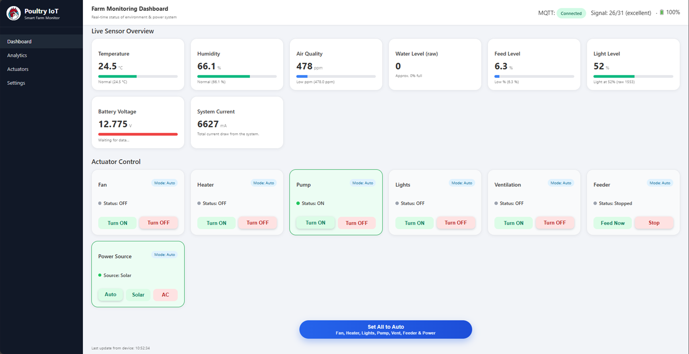

---

# Hardware

## Poultry Chamber Layout


## Water Level Sensor


## Feeder Mechanism


## Enclosure Exterior

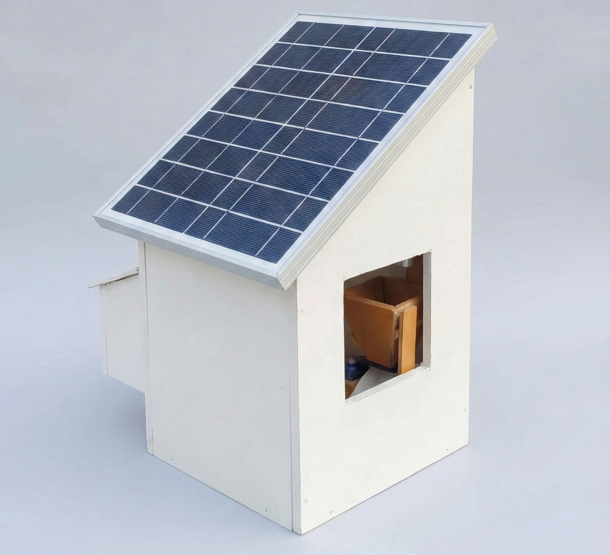

## Enclosure Interior

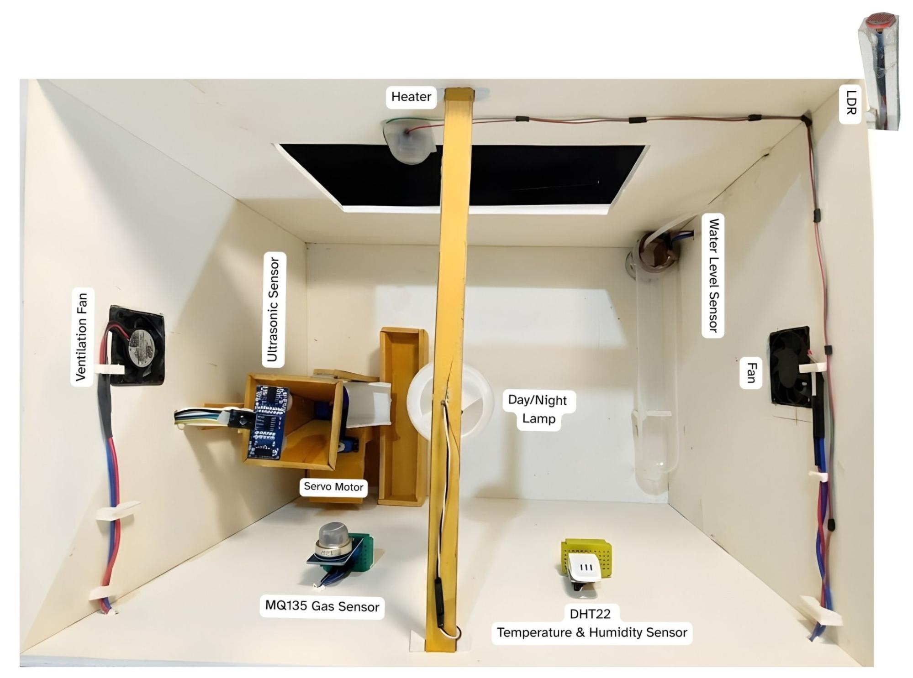

---

# Technology Stack

## Hardware

* ESP32-S3
* Temperature & Humidity Sensors
* Air Quality Sensor
* Water Level Sensor
* Feed Level Sensor
* Light Sensor
* Relay Modules
* Solar Power System
* Battery Storage System

## Software

* Arduino IDE
* ESP32 Framework
* MQTT
* Android Application
* Web Dashboard

---

# Repository Structure

```text
Smart-Poultry-Farm-IoT
│
├── docs/
├── hardware/
├── firmware/
│   └── ESP32-S3/
│
└── android-app/
    └── app/
        └── screenshots/
```

---

# Research Documentation

Additional documentation and project resources are available in the `docs` directory.

* System Architecture
* Firmware Flowcharts
* Circuit Schematics
* Methodology Documentation

---

# Future Improvements

* Cloud Database Integration
* AI-Based Disease Detection
* Predictive Feed Management
* Weather Forecast Integration
* Multi-Farm Monitoring
* Mobile Push Notifications

---

# License

This project is licensed under the MIT License.

See the LICENSE file for details.
